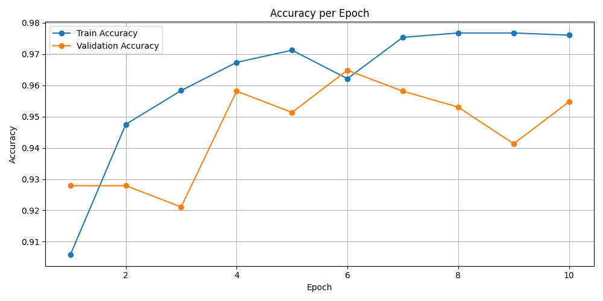
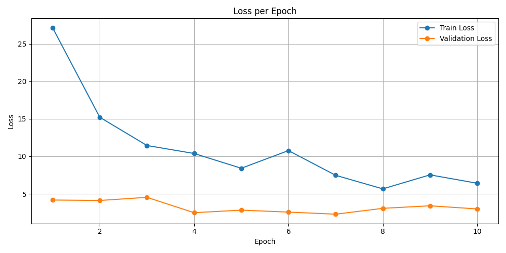

# Face Mask Detection

Bu proje, yüzlerde maske olup olmadığını tespit eden bir makine öğrenmesi uygulamasıdır. Eğitim ve doğrulama süreçleri sırasında modelin başarımını analiz etmek için çeşitli grafikler ve CSV dosyaları da dahil edilmiştir.

## Proje Özeti

Model, çeşitli görseller üzerinden eğitilerek gerçek zamanlı olarak maske takılıp takılmadığını belirlemektedir. Eğitim sürecinde hem doğruluk hem de kayıp değerleri takip edilmiştir.

## Kullanılan Algoritmalar

- HOG + SVM (`hog_svm.py`)
- CNN (eğitim ve test aşamaları `train.py` ve `test_on_images.py` içerisinde)

## Proje Yapısı

```
face-mask-detection/
│
├── accuracy_plot.png           # Eğitim ve doğrulama doğruluğu grafiği
├── loss_plot.png               # Kayıp grafiği
├── data_split.py               # Veri setini eğitim/test olarak ayırma
├── dataset.py                  # Dataset yönetimi
├── detect_realtime.py          # Gerçek zamanlı maske tespiti
├── generate_incorrect_csv.py   # Hatalı tahminleri CSV olarak kaydeder
├── hog_svm.py                  # HOG + SVM ile sınıflandırma
├── kontrol.py                  # Model kontrol fonksiyonları
├── labels.csv                  # Orijinal etiketler
├── labels_balanced.csv         # Dengelenmiş veri seti etiketleri
├── labels_extra.csv            # Ek veri etiketleri
├── parse_annotations.py        # Etiket verilerini ayrıştırır
├── plot_training.py            # Eğitim süreci grafikleri (doğruluk, kayıp)
├── test_on_images.py           # Görseller üzerinde test yapar
├── train.py                    # Model eğitimi
├── models/                     # Eğitilmiş modellerin bulunduğu klasör
└── venv/                       # Sanal Python ortamı
```

## Eğitim Sonuçları

### Accuracy



### Loss



Grafiklerde görüldüğü üzere, model eğitim sürecinde yüksek doğruluk seviyelerine ulaşmıştır. Validation accuracy zaman zaman dalgalanma gösterse de genel olarak başarılıdır.

## Kullanım

### Ortam Kurulumu

```bash
python -m venv venv
source venv/bin/activate  # Windows: venv\Scripts\activate
pip install -r requirements.txt
```

> `requirements.txt` dosyasını projenize dahil etmeyi unutmayın.

### Eğitim

```bash
python train.py
```

### Gerçek Zamanlı Tespit

```bash
python detect_realtime.py
```

## Notlar

- Eğitim verileri ve etiket dosyaları `labels.csv`, `labels_balanced.csv`, ve `labels_extra.csv` içerisinde bulunuyor.
- `generate_incorrect_csv.py`, hatalı sınıflandırmaları analiz etmek için faydalıdır.

## İletişim

Herhangi bir öneri ya da katkı için lütfen iletişime geçin.
